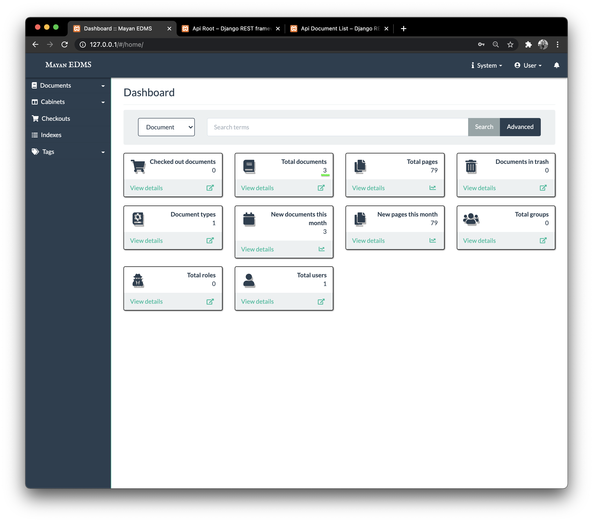
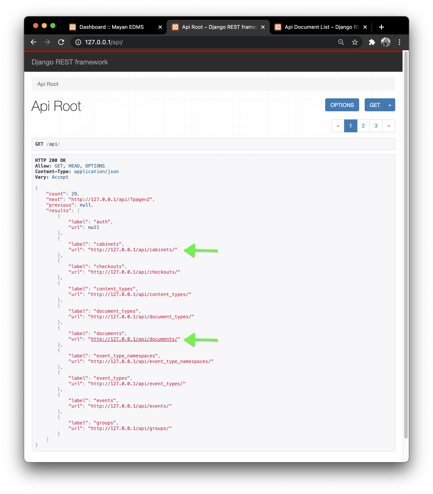
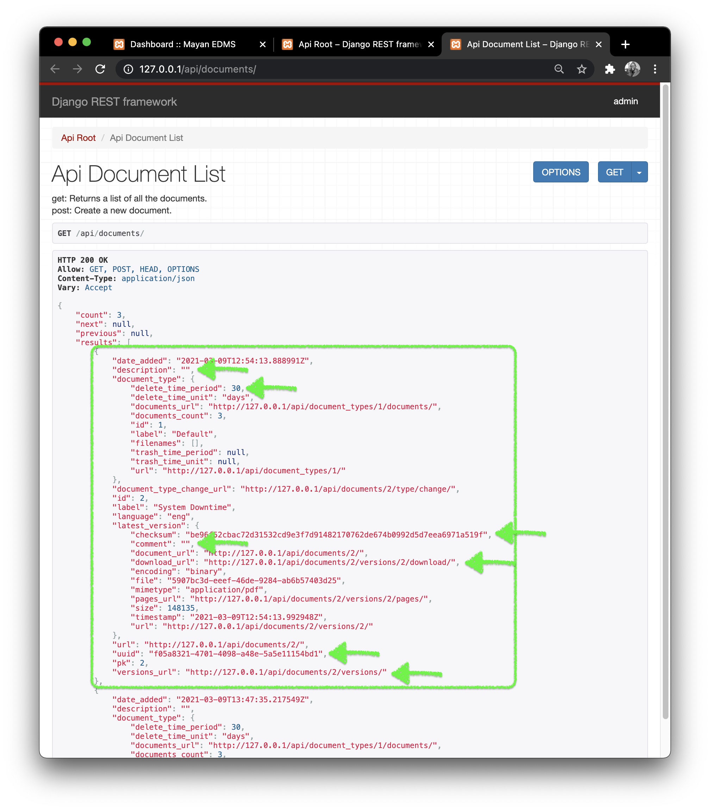

# EDMS prototype

> [Repository link](https://github.com/NdagiStanley/edms).

Adapted by [NdagiStanley](https://github.com/NdagiStanley) for CTS as a prototype example of EDMS set up.

Setup instructions can be found [here](https://github.com/NdagiStanley/edms/blob/main/README.md).

## Proposal

1. Have the usual Mayan set up (together with Celery and Redis).
1. Connect CTS (efiles module) with Mayan via a configured API with necessary endpoints.

### Considerations

1. Always have the endpoints secured requiring auth via token
1. Set up rate limiting per session (so as not to overload the servers)
1. Maintain the current set up of using *rsync* when re-instantiating or back up.

### Screenshots

 UI showing the API root endpoint

 UI showing the API endpoint for documents

The highlighted data points prove most necessary at the moment for CTS' use case.
